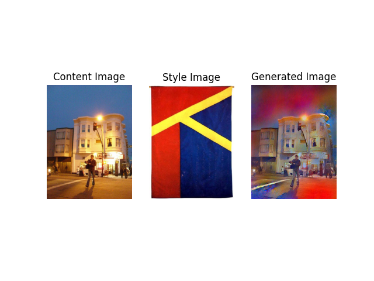
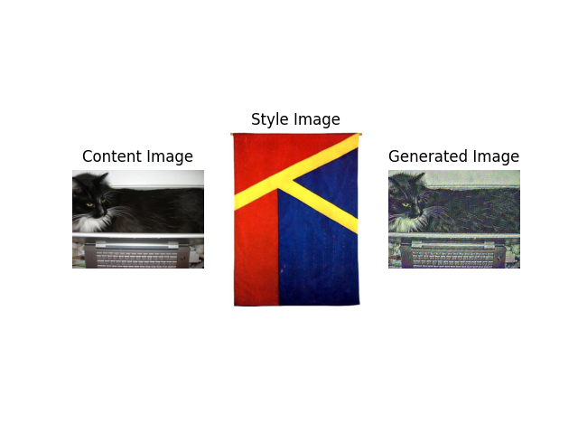
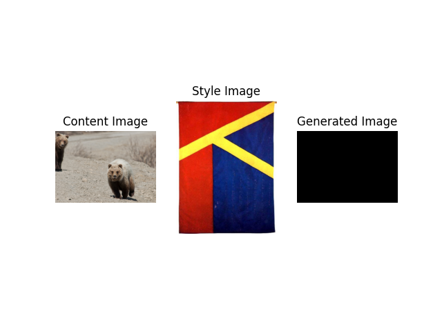
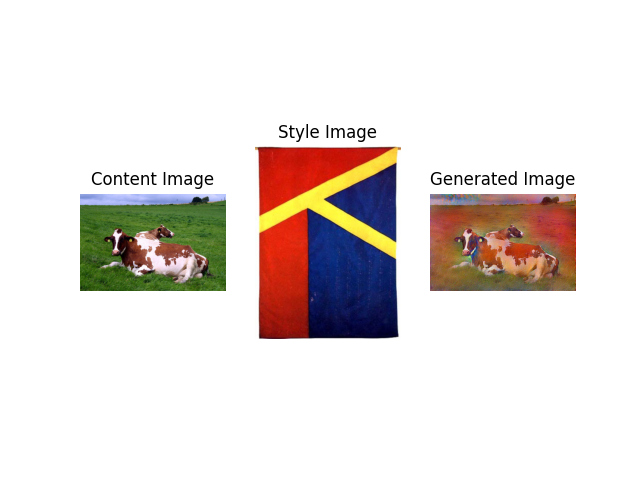
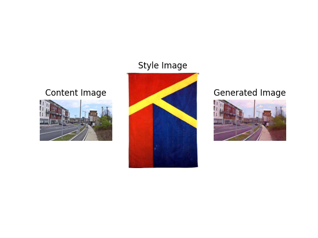
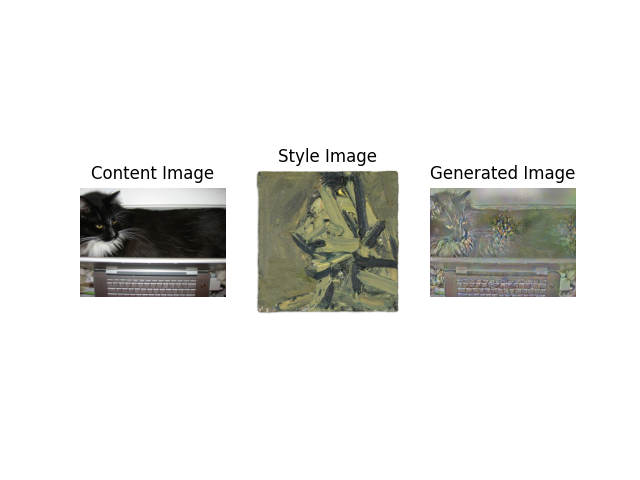
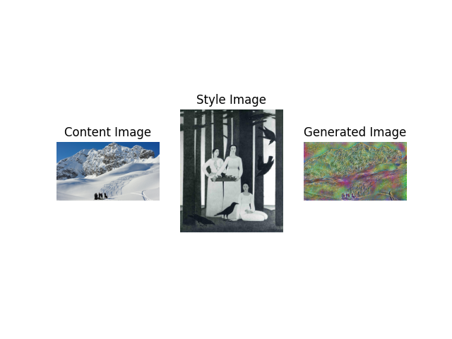
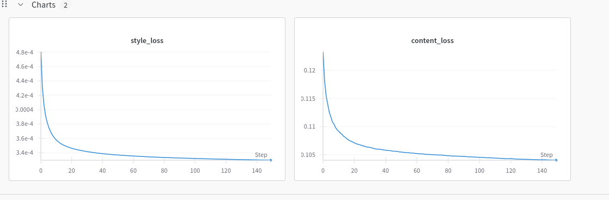
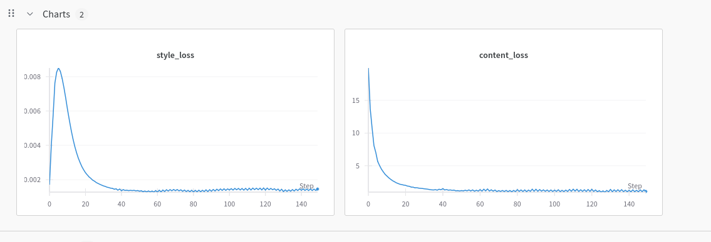

# Neural Style Transfer

A PyTorch implementation of neural style transfer using VGG19, based on the paper ["A Neural Algorithm of Artistic Style" by Gatys et al](https://arxiv.org/pdf/1508.06576).

## Overview

This project applies the artistic style from one image onto the content of another using deep convolutional neural networks. The implementation extracts features from different layers of a pretrained VGG19 network to capture both content and style representations. Read the [report](./report.pdf) for more details and the [assignment document](./docs/CV_S25_A2_Final.pdf) for the initial spec.

## Results & Findings

### Effect of Image Brightness/Contrast Similarity

|                           Good Results<br>(Similar Brightness/Contrast)                           |               Decent Results<br>(Somewhat Similar)                |                  Poor Results<br>(Dissimilar)                  |
| :-----------------------------------------------------------------------------------------------: | :---------------------------------------------------------------: | :------------------------------------------------------------: |
| <br>_White building - excellent transfer_ | <br>_Cat - acceptable transfer_ | <br>_Bear - poor transfer_ |
|                   <br>_Cows - good results_                   |      <br>_Town - decent_      |                                                                |

**style transfer seems to correlate strongly with brightness and contrast similarity** between content and style images.

### Additional Examples

| <br>_Cat with "Head of Paula Eyles" style_ | <br>_Mountains with abstract style_ |
| :-------------------------------------------------------------------------------------------------: | :------------------------------------------------------------------------------------: |

### Optimizer Comparison: L-BFGS vs Adam

Comparison using style weight = 100, content weight = 0.1, 150 steps:

|                                         L-BFGS                                          |                                      Adam                                       |
| :-------------------------------------------------------------------------------------: | :-----------------------------------------------------------------------------: |
| <br>_Stable convergence, lower final loss_ | <br>_Less stable, higher final loss_ |
|             <br>_L-BFGS result_             |       <br>_Adam result_        |

L-BFGS is the recommended optimizer. It achieves more stable convergence with significantly lower loss values and produces superior visual results. While Adam runs faster per iteration, L-BFGS requires no learning rate tuning and consistently delivers better quality.

### Impact of Weight Configuration

Through experimentation (shown in the report), the optimal configuration requires:

- **High style weight** (e.g., 1000)
- **Low content weight** (e.g., 0.1)
- **Style weight >> Content weight** (ratio ~100:1)

This asymmetry is necessary because the generated image is initialized from the content image itself.

## Architecture

- **VGG19 Features**: Extracts content from layer 21 and style from layers 0, 5, 10, 19, 28
- **Content Loss**: MSE between content features
- **Style Loss**: MSE between Gram matrices of style features
- **Optimization**: Iteratively updates generated image to minimize weighted loss

## Quick Start

```bash
# Run with default parameters
uv run python -m src.main

# Run with custom parameters
uv run python -m src.main --content_weight 0.01 --style_weight 10 --num_steps 300 --optimizer lbfgs
```

### Parameters

- `--content_weight`: Weight for content loss (default: 0.01)
- `--style_weight`: Weight for style loss (default: 10)
- `--num_steps`: Number of optimization steps (default: 10)
- `--optimizer`: Optimizer to use - `lbfgs` or `adam` (default: lbfgs)
